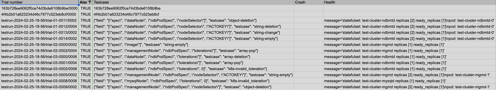

## Alarm-1

- Trial: trial-01-0011/0002
- Type: Misoperation

### What Happened

```json
"health": {
    "message": "statefulset: test-cluster-ndbmtd replicas [2] ready_replicas [1]\npod: test-cluster-ndbmtd-0"
},
```

`test-cluster-ndbmtd` only has one ready replicas, whereas the desired number of replicats is two.

### Root Cause

In `mutated-002.yaml` , acto add `ACTOKEY: ACTOKEY` in `dataNode.ndbPodSpec.nodeSelector` 

```yaml
	dataNode:
    ndbPodSpec:
      nodeSelector:
        ACTOKEY: ACTOKEY
```

I traced the source code, but It just do the copy from `ndbPodSpec` to `podSpec`, so it seems normal.

```go
	// Copy values from ndbPodSpec into podSpec
	// Copy the NodeSelector completely as the operator won't be setting any default values on it
	if len(ndbPodSpec.NodeSelector) != 0 {
		podSpec.NodeSelector = make(map[string]string)
		for key, value := range ndbPodSpec.NodeSelector {
			podSpec.NodeSelector[key] = value
		}
	}
```

Then I look at the `events-002.json` , I find an error event issued by pod with the message: 

```
"message": "0/4 nodes are available: 1 node(s) had untolerated taint {node-role.kubernetes.io/control-plane: }, 3 node(s) didn't match Pod's node affinity/selector. preemption: 0/4 nodes are available: 4 Preemption is not helpful for scheduling..",
```

indicating that the new Pod cannot be properly scheduled to nodes.

Because the desired `nodeselector` specified in MySQL-ndb CR can’t be satisfied in the current cluster state. The MySQL-ndb-operator fails to reject the wrong desired state that make the cluster lost replica.

### Expected Behavior

According to [documentation](https://github.com/mysql/mysql-ndb-operator/blob/main/docs/NdbPodSpec-doc.md), `nodeSelector` only selects nodes with all the specified labels.

The operator should reject the erroneous desired state like `ACTOKEY: ACTOKEY`.

## Alarm-2

- Trial: trial-01-0012/0004
- Type: Misoperation

### What Happened

```json
"health": {
    "message": "statefulset: test-cluster-ndbmtd replicas [2] ready_replicas [1]\npod: test-cluster-ndbmtd-0"
},
```

`test-cluster-ndbmtd` only has one ready replicas, whereas the desired number of replicas is two.

### Root Cause

In `mutated-004.yaml` , acto add `ACTOKEY: ACTOKEY` in `dataNode.ndbPodSpec.nodeSelector` 

```yaml
dataNode:
    ndbPodSpec:
      nodeSelector:
        ACTOKEY: ACTOKEY
```

I traced the source code, but It just do the copy from `ndbPodSpec` to podSpec, so it seems normal.

```go
	// Copy values from ndbPodSpec into podSpec
	// Copy the NodeSelector completely as the operator won't be setting any default values on it
	if len(ndbPodSpec.NodeSelector) != 0 {
		podSpec.NodeSelector = make(map[string]string)
		for key, value := range ndbPodSpec.NodeSelector {
			podSpec.NodeSelector[key] = value
		}
	}
```

Then I look at the `events-004.json` , I find an error event issued by pod with the message: 

```
"message": "0/4 nodes are available: 1 node(s) had untolerated taint {node-role.kubernetes.io/control-plane: }, 3 node(s) didn't match Pod's node affinity/selector. preemption: 0/4 nodes are available: 4 Preemption is not helpful for scheduling..",
```

indicating that the new Pod cannot be properly scheduled to nodes.

Because the desired `nodeselecto`r specified in MySQL-ndb CR can’t be satisfied in the current cluster state. The MySQL-ndb-operator fails to reject the wrong desired state that make the cluster lost replica.

### Expexted Behavior

The operator should reject the erroneous desired state.

## Alarm-3

- Trial: trial-01-0013/0002
- Type: Misoperation

### What Happended

```json
"health": {
   "message": "statefulset: test-cluster-ndbmtd replicas [2] ready_replicas [1]\npod: test-cluster-ndbmtd-0"
},
```

`test-cluster-ndbmtd` only has one ready replicas, whereas the desired number of replicas is two.

### Root Cause

In `mutated-002.yaml` , acto add `ACTOKEY: ACTOKEY` in `dataNode.ndbPodSpec.nodeSelector` 

```yaml
dataNode:
    ndbPodSpec:
      nodeSelector:
        ACTOKEY: ACTOKEY
```

I traced the source code, but It just do the copy from `ndbPodSpec` to `podSpec`, so it seems normal.

```go
	// Copy values from ndbPodSpec into podSpec
	// Copy the NodeSelector completely as the operator won't be setting any default values on it
	if len(ndbPodSpec.NodeSelector) != 0 {
		podSpec.NodeSelector = make(map[string]string)
		for key, value := range ndbPodSpec.NodeSelector {
			podSpec.NodeSelector[key] = value
		}
	}
```

Then I look at the `events-002.json` , I find an error event issued by pod with the message: 

```
"message": "0/4 nodes are available: 1 node(s) had untolerated taint {node-role.kubernetes.io/control-plane: }, 3 node(s) didn't match Pod's node affinity/selector. preemption: 0/4 nodes are available: 4 Preemption is not helpful for scheduling..",
```

indicating that the new Pod cannot be properly scheduled to nodes.

Because the desired `nodeselector` specified in MySQL-ndb CR can’t be satisfied in the current cluster state. The MySQL-ndb-operator fails to reject the wrong desired state that make the cluster lost replica.

### Expected Behavior

According to [documentation](https://github.com/mysql/mysql-ndb-operator/blob/main/docs/NdbPodSpec-doc.md), `nodeSelector` only selects nodes with all the specified labels.

The operator should reject the erroneous desired state like `ACTOKEY: ACTOKEY`.

## Alarm-4

- Trial: trial-01-0014/0002
- Type: Misoperation

### What Happened

```yaml
"health": {
    "message": "statefulset: test-cluster-ndbmtd replicas [2] ready_replicas [1]\npod: test-cluster-ndbmtd-0"
},
```

`test-cluster-ndbmtd` only has one ready replicas, whereas the desired number of replicas is two.

### Root Cause

In `mutated-002.yaml` , acto add `ACTOKEY: ''` in `dataNode.ndbPodSpec.nodeSelector` 

```yaml
dataNode:
    ndbPodSpec:
      nodeSelector:
        ACTOKEY: ''
```

I traced the source code, but It just do the copy from `ndbPodSpec` to `podSpec`, so it seems normal.

```go
	// Copy values from ndbPodSpec into podSpec
	// Copy the NodeSelector completely as the operator won't be setting any default values on it
	if len(ndbPodSpec.NodeSelector) != 0 {
		podSpec.NodeSelector = make(map[string]string)
		for key, value := range ndbPodSpec.NodeSelector {
			podSpec.NodeSelector[key] = value
		}
	}
```

Then I look at the `events-002.json` , I find an error event issued by pod with the message: 

```
"message": "0/4 nodes are available: 1 node(s) had untolerated taint {node-role.kubernetes.io/control-plane: }, 3 node(s) didn't match Pod's node affinity/selector. preemption: 0/4 nodes are available: 4 Preemption is not helpful for scheduling..",
```

indicating that the new Pod cannot be properly scheduled to nodes.

Because the desired `nodeselector` specified in MySQL-ndb CR can’t be satisfied in the current cluster state. The MySQL-ndb-operator fails to reject the wrong desired state that make the cluster lost replica.

### Expected Behavior

According to [documentation](https://github.com/mysql/mysql-ndb-operator/blob/main/docs/NdbPodSpec-doc.md), `nodeSelector` only selects nodes with all the specified labels.

The operator should reject the erroneous desired state like `ACTOKEY:''`.

## Alarm-5

- Trial: trial-02-0000/0002
- Type: False Alarm

### What Happened

ACTO give a empty image name.

```yaml
apiVersion: mysql.oracle.com/v1
kind: NdbCluster
metadata:
  name: test-cluster
spec:
  dataNode:
    nodeCount: 2
  image: ''
  mysqlNode:
    nodeCount: 2
  redundancyLevel: 2
```

```yaml
"health": {
    "message": "statefulset: test-cluster-mgmd replicas [1] ready_replicas [1]"
},
```

### Root Cause

According to [document](https://github.com/mysql/mysql-ndb-operator/blob/main/docs/NdbCluster-CRD.md), The name of the MySQL Ndb Cluster image to be used. If not specified, “[container-registry.oracle.com/mysql/community-cluster:8.3.0”](http://container-registry.oracle.com/mysql/community-cluster:8.3.0%E2%80%9D) will be used.

## Alarm-6

- Trial: trial-02-0002/0004
- Type: Misoperation

### What Happened

Acto change the `managementNode.ndbPodSpec.tolerations` to:

```yaml
managementNode:
    ndbPodSpec:
      tolerations:
      - effect: null
        key: ACTOKEY
        operator: null
        tolerationSeconds: 2
        value: ACTOKEY
```

`test-cluster-mgmd` has one ready replicas, and the desired number of replicas is also one.

```json
"health": {
    "message": "statefulset: test-cluster-mgmd replicas [1] ready_replicas [1]"
    },
},
```

### Root Cause

According to [documentation](https://kubernetes.io/docs/concepts/scheduling-eviction/taint-and-toleration/#example-use-cases), the tolerations has a specific term that need to use rather than **ACTOKEY** or **null** or some **random strings**.

- **`effect`** need to be **`NoSchedule`**, **`PreferNoSchedule`**, and **`NoExecute`**. These effects determine how the taint affects pods that do not tolerate the taint.
- **`operator`**: Specifies how to match the key. Common operators include **`Exists`** and **`Equal`**. Setting this to **`null`** is unusual and might be an error or placeholder.
- **`tolerationSeconds`**: Only relevant with the **`NoExecute`** effect, it specifies how long a pod can stay on the node after it starts not matching the taint.
- **`value`**: The value of the taint that the pod can tolerate

### **Expected Behavior**

The operator should reject the incorrect desired state.

## Alarm-7

- Trial: trial-03-0000/0006
- Type: Misoperation

### What Happened

```yaml
	dataNode:
    ndbPodSpec:
      tolerations:
      - effect: ACTOKEY
        key: ACTOKEY
        operator: ACTOKEY
        tolerationSeconds: 5
        value: ACTOKEY
```

`test-cluster-ndbmtd` has one ready replicas, and the desired number of replicas is also one.

```json
"health": {
    "message": "statefulset: test-cluster-ndbmtd replicas [1] ready_replicas [1]"
    },
},
```

### Root Cause

According to [documentation](https://kubernetes.io/docs/concepts/scheduling-eviction/taint-and-toleration/#example-use-cases), the tolerations has a specific term that need to use rather than **ACTOKEY** or **null** or some **random strings**.

- **`effect`** need to be **`NoSchedule`**, **`PreferNoSchedule`**, and **`NoExecute`**. These effects determine how the taint affects pods that do not tolerate the taint.
- **`operator`**: Specifies how to match the key. Common operators include **`Exists`** and **`Equal`**. Setting this to **`null`** is unusual and might be an error or placeholder.
- **`tolerationSeconds`**: Only relevant with the **`NoExecute`** effect, it specifies how long a pod can stay on the node after it starts not matching the taint.
- **`value`**: The value of the taint that the pod can tolerate

### **Expected Behavior**

The operator should reject the incorrect desired state.

## Alarm-8

- Trial: trial-03-0001/0004
- Type: Misoperation

### What Happened

```yaml
dataNode:
    ndbPodSpec:
      tolerations:
      - effect: ACTOKEY
        key: ACTOKEY
        operator: ACTOKEY
        tolerationSeconds: 5
        value: ACTOKEY
```

`test-cluster-ndbmtd` has one ready replicas, and the desired number of replicas is also one.

```yaml
"health": {
    "message": "statefulset: test-cluster-ndbmtd replicas [1] ready_replicas [1]"
},
```

### Root Cause

According to [documentation](https://kubernetes.io/docs/concepts/scheduling-eviction/taint-and-toleration/#example-use-cases), the tolerations has a specific term that need to use rather than **ACTOKEY** or **null** or some **random strings**.

- **`effect`** need to be **`NoSchedule`**, **`PreferNoSchedule`**, and **`NoExecute`**. These effects determine how the taint affects pods that do not tolerate the taint.
- **`operator`**: Specifies how to match the key. Common operators include **`Exists`** and **`Equal`**. Setting this to **`null`** is unusual and might be an error or placeholder.
- **`tolerationSeconds`**: Only relevant with the **`NoExecute`** effect, it specifies how long a pod can stay on the node after it starts not matching the taint.
- **`value`**: The value of the taint that the pod can tolerate

### **Expected Behavior**

The operator should reject the incorrect desired state.

## Alarm-9

- Trial: trial-03-0002/0008
- Type: Misoperation

### What Happened

```yaml
dataNode:
    ndbPodSpec:
      tolerations:
      - effect: INVALID_EFFECT
        key: test-key
        operator: Equal
        tolerationSeconds: 0
        value: test-value
```

`test-cluster-ndbmtd` has one ready replicas, and the desired number of replicas is also one.

```yaml
"health": {
    "message": "statefulset: test-cluster-ndbmtd replicas [1] ready_replicas [1]"
},
```

### Root Cause

According to [documentation](https://kubernetes.io/docs/concepts/scheduling-eviction/taint-and-toleration/#example-use-cases), the tolerations has a specific term that need to use rather than **ACTOKEY** or **null** or some **random strings**.

- **`effect`** need to be **`NoSchedule`**, **`PreferNoSchedule`**, and **`NoExecute`**. These effects determine how the taint affects pods that do not tolerate the taint.
- **`operator`**: Specifies how to match the key. Common operators include **`Exists`** and **`Equal`**. Setting this to **`null`** is unusual and might be an error or placeholder.
- **`tolerationSeconds`**: Only relevant with the **`NoExecute`** effect, it specifies how long a pod can stay on the node after it starts not matching the taint.
- **`value`**: The value of the taint that the pod can tolerate

### **Expected Behavior**

The operator should reject the incorrect desired state.

## Alarm-10

- Trial: trial-03-0005/0002
- Type: Misoperation

### What Happened

```yaml
"health": {
    "message": "statefulset: test-cluster-mgmd replicas [2] ready_replicas [1]\npod: test-cluster-mgmd-1"
},
```

`test-cluster-mgmd` only has one ready replicas, whereas the desired number of replicas is two.

### Root Cause

```yaml
managementNode:
    ndbPodSpec:
      nodeSelector:
        ACTOKEY: ''
```

I traced the source code, but It just do the copy from `ndbPodSpec` to `podSpec`, so it seems normal.

```go
	// Copy values from ndbPodSpec into podSpec
	// Copy the NodeSelector completely as the operator won't be setting any default values on it
	if len(ndbPodSpec.NodeSelector) != 0 {
		podSpec.NodeSelector = make(map[string]string)
		for key, value := range ndbPodSpec.NodeSelector {
			podSpec.NodeSelector[key] = value
		}
	}
```

Then I look at the `events-002.json` , I find an error event issued by pod with the message: 

```
"message": "0/4 nodes are available: 1 node(s) had untolerated taint {node-role.kubernetes.io/control-plane: }, 3 node(s) didn't match Pod's node affinity/selector. preemption: 0/4 nodes are available: 4 Preemption is not helpful for scheduling..",
```

indicating that the new Pod cannot be properly scheduled to nodes.

Because the desired `nodeselector` specified in MySQL-ndb CR can’t be satisfied in the current cluster state. The MySQL-ndb-operator fails to reject the wrong desired state that make the cluster lost replica.

### Expected Behavior

According to [documentation](https://github.com/mysql/mysql-ndb-operator/blob/main/docs/NdbPodSpec-doc.md), `nodeSelector` only selects nodes with all the specified labels.

The operator should reject the erroneous desired state like `ACTOKEY: ''`.

## Alarm-11

- Trial: trial-03-0008/0008
- Type: Misoperation

### What Happened

```yaml
mysqlNode:
    ndbPodSpec:
      tolerations:
      - effect: INVALID_EFFECT
        key: test-key
        operator: Equal
        tolerationSeconds: 0
        value: test-value
```

`test-cluster-mysqld` has one ready replicas, and the desired number of replicas is also one.

```yaml
"health": {
    "message": "statefulset: test-cluster-mysqld replicas [1] ready_replicas [1]"
},
```

### Root Cause

According to [documentation](https://kubernetes.io/docs/concepts/scheduling-eviction/taint-and-toleration/#example-use-cases), the tolerations has a specific term that need to use rather than **ACTOKEY** or **null** or some **random strings**.

- **`effect`** need to be **`NoSchedule`**, **`PreferNoSchedule`**, and **`NoExecute`**. These effects determine how the taint affects pods that do not tolerate the taint.
- **`operator`**: Specifies how to match the key. Common operators include **`Exists`** and **`Equal`**. Setting this to **`null`** is unusual and might be an error or placeholder.
- **`tolerationSeconds`**: Only relevant with the **`NoExecute`** effect, it specifies how long a pod can stay on the node after it starts not matching the taint.
- **`value`**: The value of the taint that the pod can tolerate

### **Expected Behavior**

The operator should reject the incorrect desired state.

## Alarm-12

- Trial: trial-03-0009/0002
- Type: Misoperation

### What Happened

```yaml
"health": {
     "message": "statefulset: test-cluster-mgmd replicas [2] ready_replicas [1]\npod: test-cluster-mgmd-1"
},
```

`test-cluster-mgmd` only has one ready replicas, whereas the desired number of replicas is two.

### Root Cause

```yaml
managementNode:
    ndbPodSpec:
      nodeSelector:
        ACTOKEY: ACTOKEY
```

I traced the source code, but It just do the copy from `ndbPodSpec` to `podSpec`, so it seems normal.

```go
	// Copy values from ndbPodSpec into podSpec
	// Copy the NodeSelector completely as the operator won't be setting any default values on it
	if len(ndbPodSpec.NodeSelector) != 0 {
		podSpec.NodeSelector = make(map[string]string)
		for key, value := range ndbPodSpec.NodeSelector {
			podSpec.NodeSelector[key] = value
		}
	}
```

Then I look at the `events-002.json` , I find an error event issued by pod with the message: 

```
"message": "0/4 nodes are available: 1 node(s) had untolerated taint {node-role.kubernetes.io/control-plane: }, 3 node(s) didn't match Pod's node affinity/selector. preemption: 0/4 nodes are available: 4 Preemption is not helpful for scheduling..",
```

indicating that the new Pod cannot be properly scheduled to nodes.

Because the desired `nodeselector` specified in MySQL-ndb CR can’t be satisfied in the current cluster state. The MySQL-ndb-operator fails to reject the wrong desired state that make the cluster lost replica.

### Expected Behavior

According to [documentation](https://github.com/mysql/mysql-ndb-operator/blob/main/docs/NdbPodSpec-doc.md), `nodeSelector` only selects nodes with all the specified labels.

The operator should reject the erroneous desired state like `ACTOKEY: ACTOKEY` .

# Summary of Report



- 1~4(dataNode): nodeSelector
- 5: image: ‘ ‘
- 6~9(dataNode): toleration
- 10, 12(managementNode): nodeSelector
- 11(mysqlnode): toleration

Most of the alarms are caused by the misoperation and that operator didn’t reject the erroneous desired state.